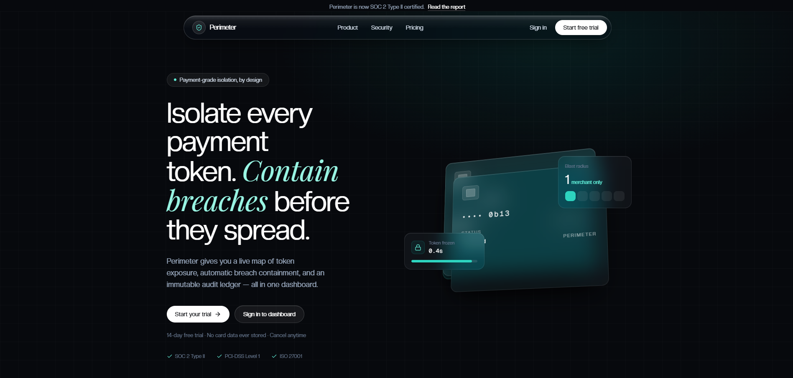
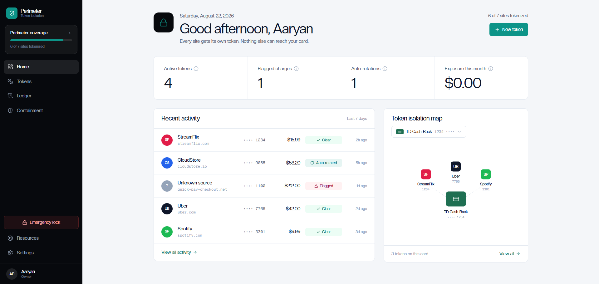
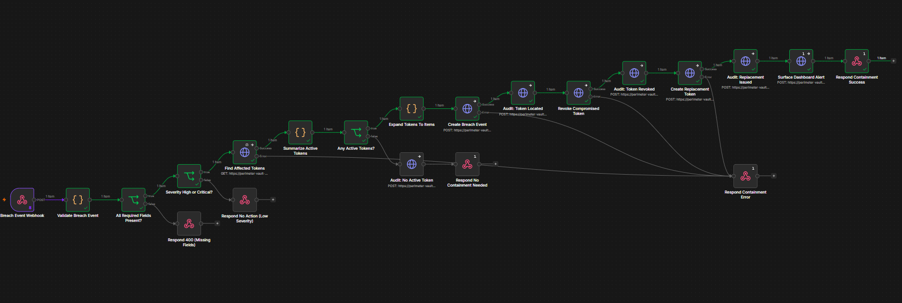

# Perimeter — Token Isolation Platform

*One funding source. One token per merchant. Zero blast radius.*

> Isolate every payment token. Contain breaches before they spread.

**Hackathon Track:** FinTech · **Category:** Security

## Live demo

Try the deployed dashboard: **[https://perimeter-beta.vercel.app](https://perimeter-beta.vercel.app)**

Create an account (name + username + password — real Supabase auth), then explore Tokens, Ledger, and Containment against the live Vault API. For the full experience — generating a token with the Chrome extension at checkout and watching it sync into the dashboard — run the demo locally (see [Running the demo](#running-the-demo)).

## Screenshots





## Inspiration

Your card number is the master key to every merchant you've ever paid. One breach at any of them — a hacked checkout, a leaked database, a rogue employee — and that single number is suddenly spending with someone else's name on it. The industry answer is network tokenization, but at the consumer level most people still hand their real PAN to every merchant they buy from, and "containment" means a frantic call to the bank.

We wanted to bring the isolation banks use between networks down to the merchant level: one disposable, isolated token per merchant, so a breach at one place can never touch the rest of your money. And we wanted that safety to be visible — a live map of exposure, an automated containment runbook, and a kill switch that takes one click, not one phone call.

## What it does

Perimeter is a token isolation platform with a real, working backend:

- **Per-merchant isolated tokens.** Every merchant gets its own token with a merchant-locked domain, a monthly spending limit, and optional one-time-use or auto-expiry. A token can only be charged by the domain it was issued to.
- **Live exposure map.** A hand-built SVG radial map shows your funding source and every merchant token at a glance — status, risk, and last four digits, no charting library required.
- **Transaction screening at the API edge.** Every charge is checked against three rules — token status, source-domain match, and monthly limit — and cleared or flagged with a reason.
- **Automated breach containment.** Report a breach and the API revokes every active token for that merchant and issues replacements automatically, returning the rotation pair. The dashboard walks through the full timeline: detected → matched → revoked → replaced → notified.
- **Emergency Lock.** One click pauses every token. No merchant can charge anything until you resume.
- **Immutable audit ledger.** Every action — issuance, rotation, revocation, containment — is recorded in a tamper-evident trail.
- **Risk scoring that's explainable.** A merchant's risk level is derived from concrete flagged transactions, not a black box: two flags make it High, one makes it Medium.

## Automation

Breach containment runs on its own. An [n8n](https://n8n.io) workflow — *Perimeter - Breach Containment* — turns the dashboard's containment timeline into a live, event-driven runbook:



A webhook receives the breach event, validates it (required fields, then a high/critical severity gate), and matches the vendor's active tokens through the Vault API. If any exist, the workflow creates the breach event, revokes each compromised token, issues a replacement with the same limits, writes every step to the audit ledger (located → revoked → replaced → notified), and answers the caller. Low-severity events and vendors with no active tokens short-circuit with clean responses; any API failure returns a 500 so nothing is silently dropped.

- **Live workflow:** [Perimeter - Breach Containment](https://lohit22.app.n8n.cloud/workflow/BvDtuRsfc8M89lse)
- **Importable JSON:** [`workflows/perimeter-breach-containment.json`](workflows/perimeter-breach-containment.json) — in n8n, use **Workflows → Import from File** to load it into your own instance.

## Chrome Extension

Perimeter ships with a Chrome **Manifest V3** extension that brings token isolation directly into checkout — instead of entering a real card number, users generate a merchant-scoped Perimeter token and inject it straight into the payment field.

```
Checkout page
     ↓
Detect merchant domain
     ↓
Generate Perimeter Token → POST /tokens → Vault API
     ↓
GET /tokens/{id}/reveal
     ↓
Inject token into card field
```

The extension:

- Detects the current checkout domain.
- Requests a merchant-scoped token from the Perimeter Vault API.
- Uses the configured monthly limit and recurring-payment policy.
- Retrieves the token through the secure reveal endpoint.
- Automatically fills the payment field with the generated token.
- Stores the demo API key in `chrome.storage.local` rather than committing it to the repository.

### Try the extension

Load it locally through Chrome Developer Mode:

1. Go to `chrome://extensions`
2. Enable **Developer mode**
3. Click **Load unpacked** and select the repo's `extension/` folder
4. Open the demo checkout: `extension/demo/checkout.html`
5. Click the card-number field, open the Perimeter extension, and click **Generate Perimeter Token** — the token is injected into the payment field

The demo uses the live Perimeter Vault API, while the included checkout page provides a safe environment for testing the complete token-generation and injection flow.

> **Note:** The extension is currently distributed as an unpacked hackathon MVP and is not yet published to the Chrome Web Store.

## How we built it

**Frontend.** Vite + React 18 + TypeScript + Tailwind CSS 3, with React Router for the five-page app and Zustand for modal state. The centerpiece Token Isolation Map is pure SVG/CSS positioned radially around the funding source — deliberately zero charting dependencies. The dashboard is wired to the live Vault API (with a mock fallback if the API is unreachable) and protected by Supabase auth — username + password, with the signed-in name shown in the UI.

**Data model.** The API is built on a payment-shaped schema: `Vendor` → `Token` (one-to-many) → `Transaction`, plus `BreachEvent` and `AuditEvent` for the containment and audit story. Tokens never store the real number in the clear — the full value is encrypted at rest, with only the last four digits kept unmasked for display.

**Vault API.** A FastAPI service (`vault-api/`) backed by PostgreSQL via asyncpg and SQLModel. Every route is protected by a shared secret in the `X-API-Key` header, compared in constant time. Tokens are encrypted with AES-256-GCM (12-byte nonce, stored as `nonce:ciphertext`, base64).

**Decision engine.** A charge is `flagged` if the token isn't active, if the source domain doesn't match the token's vendor domain (exact or subdomain), or if the amount would blow the monthly limit — otherwise it clears and counts against spend. Flagged charges accumulate into merchant risk.

## Challenges we ran into

- **Encryption without breaking the mask.** We wanted full AES-GCM encryption at rest but the UI still shows `•••• 1100`. We ended up storing the encrypted value and a separate unmasked last-four field, and being deliberate about what can ever exist in the clear.
- **Domain matching is genuinely hard.** A charge from `www.amazon.co.uk` shouldn't clear against `amazon.com`, but naive suffix checks let anything ending in `.com` through. Our rule (exact match or `.{domain}` suffix) handles subdomains cleanly but a production system needs real registrable-domain logic.
- **Risk scoring had to be explainable.** We kept it derived from concrete flagged transactions so every High and Medium has a paper trail.
- **Two halves of a product in parallel.** The dashboard started on a typed mock dataset while the vault-api grew into a full service alongside it. Wiring the two together end to end — matching every API shape, adding auth, and keeping a mock fallback — was real work.

## Accomplishments that we're proud of

- **Real encryption at rest** — token values are AES-256-GCM encrypted with proper nonce handling, not obfuscated.
- **Containment that actually rotates.** Report a breach and the API revokes and re-issues tokens for you — the timeline on the dashboard isn't a mock, it's the workflow the backend implements.
- **A dependency-light frontend.** The isolation map, the radial layout, the containment timeline — all hand-built SVG and CSS.
- **A kill switch with ceremony.** Emergency Lock demands a checkbox confirmation and shows exactly what it's about to do, because a panic button you can hit by accident is worse than none.

## What we learned

- How to design a payment-token-shaped data model and keep secrets safe at rest — nonce management, key handling, and what can and cannot live in the clear.
- Async FastAPI + SQLModel patterns: lifespan DB initialization, dependency-injected sessions, router-per-resource organization.
- Security tools live or die on UX. The isolation map and containment timeline are what make a serious, abstract concept feel approachable — and they're the hardest parts to build well.
- Trust boundaries are subtle. "Does this domain belong to this merchant?" sounds trivial and isn't.

## What's next

- Publish the Chrome extension to the Chrome Web Store.
- A live breach feed over SSE/WebSockets instead of polled history.
- Registrable-domain matching (public suffix list) for transaction screening.
- A settings screen in the Chrome extension for entering the API key.

## Built With

Frontend: React, TypeScript, Vite, Tailwind CSS 3, Zustand, React Router, lucide-react.

Backend: FastAPI, SQLModel, asyncpg, PostgreSQL, cryptography (AES-GCM), uvicorn.

Automation: n8n — live breach-containment workflow with webhook trigger.

Chrome extension: Manifest V3 (vanilla JS), wired to the live Vault API.

Deployment: Render (Vault API), Vercel (live dashboard).

## Getting Started

### Running the demo (recommended)

The backend (Vault API) and the n8n workflow are already deployed and live — locally you only run the two frontends.

**1. Dashboard**

```bash
npm install
npm run dev
```

Open http://localhost:5173 — you'll be asked to **create an account** (name + username + password), then you land on the dashboard.

**2. Demo checkout page** (second terminal)

```bash
npm run demo
```

Open http://localhost:5500/checkout.html — the fake merchant store for the extension demo.

**3. Load the Chrome extension**

1. Go to `chrome://extensions` → enable **Developer mode**
2. Click **Load unpacked** and select the repo's `extension/` folder
3. Set the API key once — the extension reads it from `chrome.storage.local`, never from the repo. Open the **service worker** on the extension's card and run in its console:

   ```js
   chrome.storage.local.set({ perimeterApiKey: "your X-API-Key" })
   ```

   (use the same `X-API-Key` the Vault API expects)

**4. The full demo flow**

1. On the checkout page, click the **Card Number** field → open the Perimeter extension → **Generate Perimeter Token** — a masked token like `perim_••••5989` is injected into the payment field
2. Fill in expiry/CVV → **Complete Purchase** → the transaction is approved with the token
3. Back in the dashboard, the token appears in **Ledger** and the **Token isolation map** on Home
4. Open **Containment** → **Simulate Breach Event** → watch the red incident banner, the green **"Breach contained"** callout, and the four-step timeline (Token Located → Revoked → Replacement Issued → User Notified)
5. Try **Emergency lock** in the sidebar to pause every token, then **Resume activity**

### Dashboard env vars

The dashboard reads four vars from `.env` (copy `.env.example`):

```
VITE_VAULT_API_URL=https://perimeter-vault-api.onrender.com
VITE_VAULT_API_KEY=<your vault API key>
VITE_SUPABASE_URL=<your supabase project URL>
VITE_SUPABASE_ANON_KEY=<your supabase anon key>
```

### Vault API (backend)

```bash
cd vault-api
python -m venv .venv && source .venv/bin/activate
pip install -r requirements.txt
```

Copy `.env.example` to `.env` and fill in:

- `DATABASE_URL` — Postgres connection string (the asyncpg driver is applied automatically)
- `ENCRYPTION_KEY` — base64 of a 32-byte key:
  ```bash
  python -c "import base64,os;print(base64.b64encode(os.urandom(32)).decode())"
  ```
- `SERVICE_API_KEY` — any shared secret; send it as the `X-API-Key` header

Then:

```bash
python seed.py        # creates demo vendors + encrypted tokens
uvicorn main:app --reload
```

API docs at http://localhost:8000/docs. `GET /health` confirms the service is up.

## Project Structure

```
├── src/                  # React dashboard
│   ├── pages/            # Hero, Login, Dashboard, Ledger, Containment, Settings
│   ├── components/       # Isolation Map, Activity Feed, modals, layout shell
│   ├── data/mock.ts      # typed mock dataset powering the UI
│   └── state/modals.ts   # Zustand modal state
├── vault-api/            # FastAPI + Postgres backend
│   ├── routers/          # vendors, tokens, transactions, breaches, ledger, audit, emergency lock
│   ├── crypto.py         # AES-256-GCM encryption/decryption
│   ├── auth.py           # X-API-Key auth (constant-time compare)
│   ├── models.py         # SQLModel schema
│   └── seed.py           # demo data
├── extension/            # Chrome extension (Manifest V3)
├── workflows/            # n8n breach-containment workflow export
├── screenshots/          # README screenshots
└── public/shield.svg     # app icon
```

## API Overview

| Method | Route | What it does |
| --- | --- | --- |
| POST | `/vendors` | Register a merchant/vendor |
| POST | `/tokens` | Issue an isolated, encrypted token |
| GET | `/tokens` | List tokens (filter by domain/status) |
| POST | `/tokens/{id}/revoke` | Permanently revoke a token |
| GET | `/tokens/{id}/reveal` | Decrypt and reveal a token value (active tokens only) |
| POST | `/transactions` | Screen a charge: clear or flag with a reason |
| POST | `/breach-events` | Report a breach; auto-revoke + rotate tokens |
| GET | `/ledger` | Merchants, risk levels, and activity feed |
| POST / GET | `/audit-events` | Append / read the audit trail |
| POST | `/emergency-lock` | Pause every active token across all vendors |
| POST | `/emergency-lock/resume` | Resume tokens paused by an emergency lock |

## Try it out

- Live dashboard: https://perimeter-beta.vercel.app
- GitHub repo: [lohit555/Perimeter](https://github.com/lohit555/Perimeter)
